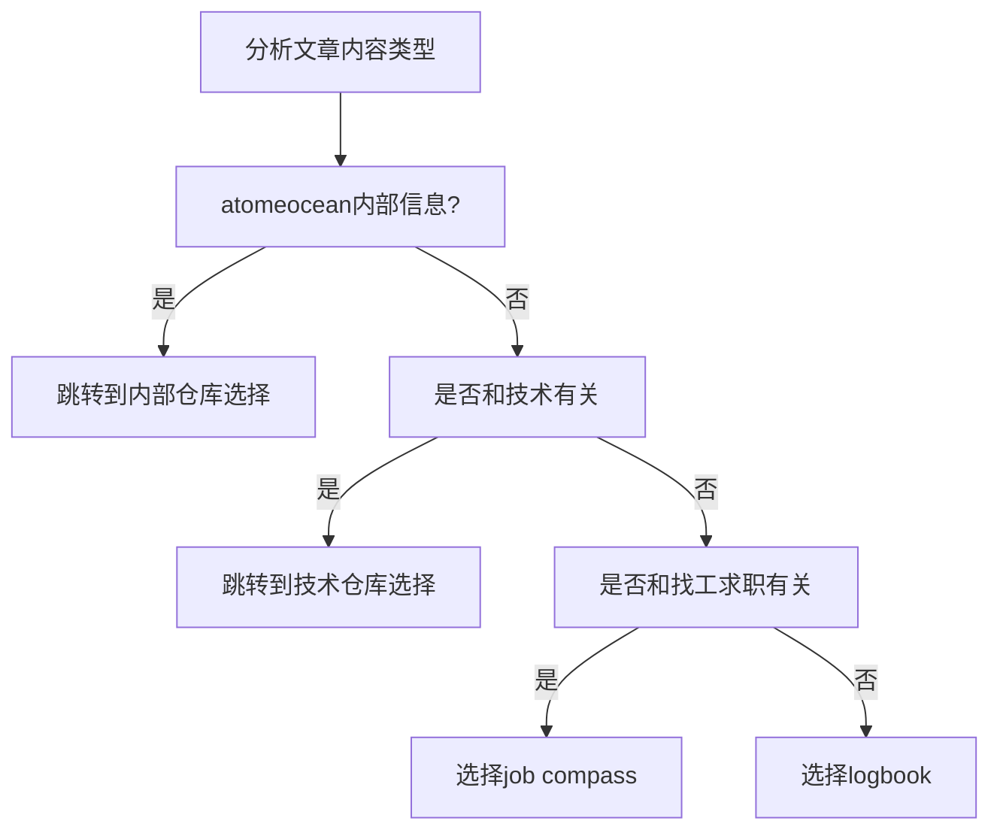

# 根据内容选择仓库

## 仓库选择示意图

## 网站地址

### job compass {#job-compass}

- [atomeocean找工求职](http://jobcompass.atomeocean.com/)
- github地址：[job-compass](https://github.com/atomeocean/job-compass)

### logbook {#logbook}

- [atomeocean航海日志](http://logbook.atomeocean.com/)
- github地址：[logbook](https://github.com/atomeocean/logbook)

## 下一步

选定仓库为 Logbook 后，参见[内容放置指南](/guide/contribute-note/content-placement.md)选择具体目录。
